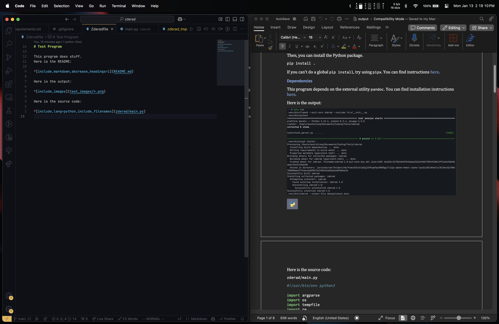

# Zderad

`zderad` is a Python program (naturally) that takes your academic program
directories and puts them into a nicely formatted Microsoft Word document for
Moodle submission.



## WARNING

Before using `zderad`, please make sure you know not to use it with untrusted
`Zderadfile`s. Treat untrusted `Zderadfile`s like untrusted code. See the
[`exec` directive](docs/directives/exec.md) for more details.

## Installation

To install, first clone the GitHub Repo:

```bash
git clone https://github.com/austinlongmn/zderad.git
cd zderad
```

Then, you can install the Python package.

```bash
pip install .
```

If you can't do a global `pip install`, try using `pipx`. You can find
instructions [here](https://pipx.pypa.io/stable/installation/).

After that, make sure you have `pandoc` installed:

## Dependencies

This program depends on the external utility `pandoc`. You can find installation
instructions [here](https://pandoc.org/installing.html).

## Usage

In its intended use, you can run `zderad` with the following command:

```bash
zderad
```

However, sometimes, more specific approaches are necessary. Try `zderad --help`
for more details.

To get `zderad` to do anything useful, you need a `Zderadfile`. Take a look at
[the documentation](docs/zderadfile_format.md).
